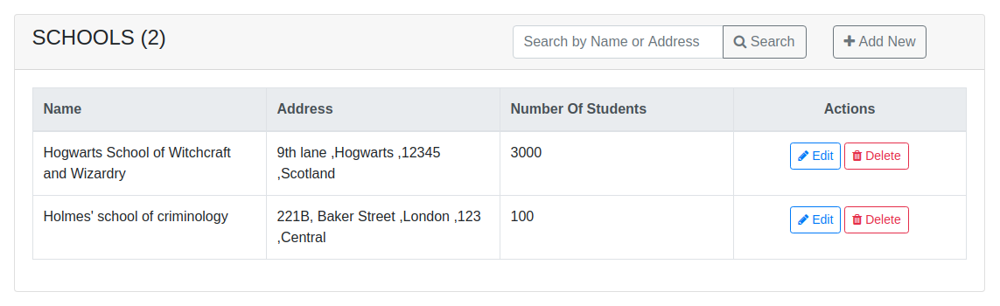
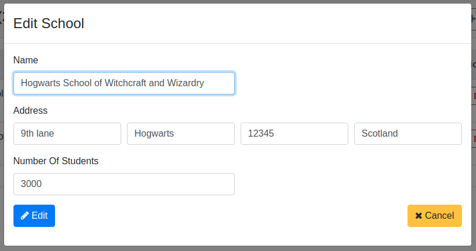
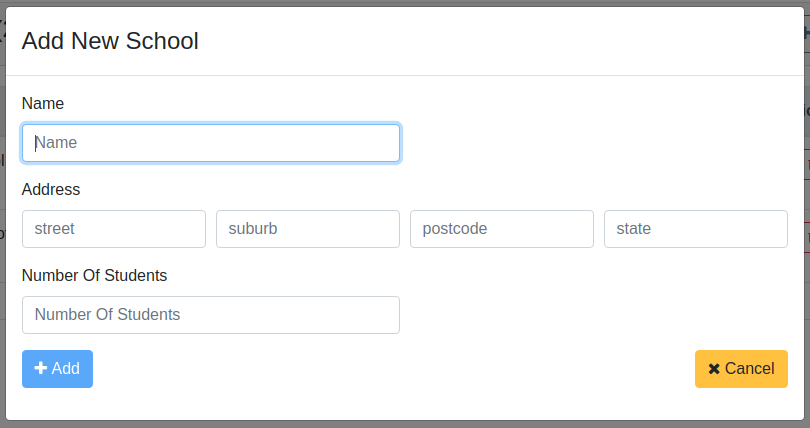

# Sklist

This project was generated with [Angular CLI](https://github.com/angular/angular-cli) version 9.0.5.

This application let user to store school information and perform crud operations on them.

## Technologies used:

This project uses the [MEAN stack](https://en.wikipedia.org/wiki/MEAN_(software_bundle)):
* [**M**ongoDB](https://www.mongodb.com) : database
* [**E**xpress](http://expressjs.com): backend framework
* [**A**ngular](https://angular.io): frontend framework
* [**N**ode.js](https://nodejs.org): runtime environment

Other technologies used,
* [Angular CLI](https://cli.angular.io): frontend scaffolding
* [Bootstrap](http://www.getbootstrap.com): layout and styles
* [Font Awesome](http://fontawesome.com): icons

## Prerequisites
1. Install [Node.js](https://nodejs.org) and [MongoDB](https://www.mongodb.com)
2. Install Angular CLI: `npm i -g @angular/cli`
3. From project root folder install all the dependencies: `npm i`

## Development server

Run `ng run dev` for a dev server. Navigate to `http://localhost:4200/`. The app will automatically reload if you change any of the source files.

## Build

Run `ng build` to build the project. The build artifacts will be stored in the `dist/` directory. Use the `--prod` flag for a production build.

## Running unit tests

Run `ng test` to execute the unit tests via [Karma](https://karma-runner.github.io).

## User Interface

List of schools

Edit school

Add school
